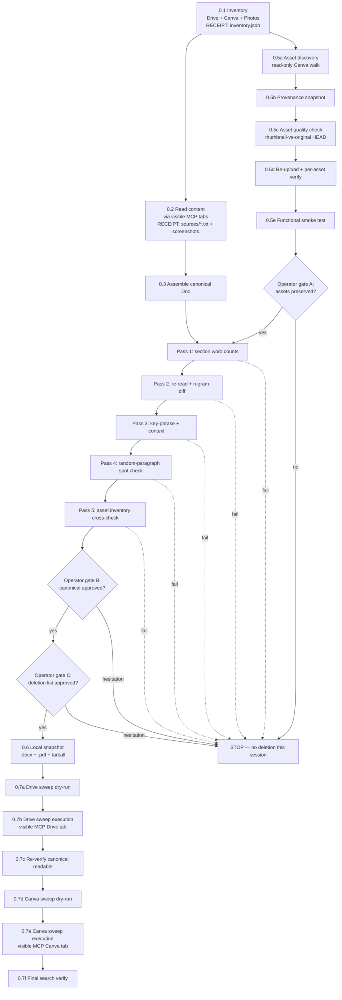

# BioVega Consolidation + Field Manual Rebuild

## Context

**Two problems being solved in one plan:**

1. **The immediate problem.** `DAHKgK7YGSg` ("BioVega Field Manual") is filled with supplements/clean-nutrition copy (pea protein, ashwagandha, Daily Greens). I hallucinated that subject matter from a stale compaction summary. The actual BioVega — confirmed by the user's blueprint at Drive `1izprDD-JFhtfo5Y_CiMC1X-Km-p2ueTX23X1EwSk9h8` — is an off-grid sustainability field manual series: Biodiesel, Biogas, Wind/Electric, Materials/Foundations, Herbal Medicine.

2. **The root cause.** BioVega knowledge is scattered across ~15 surfaces: Drive docs, Drive PDFs, multiple Canva designs (183p, 61p, 14p, 11p, 1p), Google Photos. No canonical source. Compaction summaries drift, agents can't deep-recall, and the user has been re-explaining the brand to me. The user's directive: consolidate everything into ONE Google Doc, verify, then full clean sweep of duplicates across Drive + Canva (photos untouched, Field Manual design survives).

The consolidation MUST happen first. Otherwise we just produce another BioVega artifact on top of the same mess.

---

## Visibility & Anti-Hallucination Doctrine (applies to every Phase 0 step)

The operator pays for hallucinations. Every claim this plan makes must be backed by a receipt the operator can open and inspect. The rules:

1. **Every authenticated-account action runs in a visible MCP tab.** Drive reads, Canva reads, Canva edits — all happen in MCP-managed Chrome tabs the operator can watch in real time. No headless API calls against accounts without a parallel visible tab showing the same state. (CLAUDE.md §1a, §7.)
2. **Screenshot before commit, screenshot after commit.** Any Canva `commit-editing-transaction`, any Drive write, any deletion — capture a screenshot immediately before and immediately after. Both go on disk to `~/AI_CONTEXT/biovega_receipts_<date>/`.
3. **Every assertion produces an inspectable artifact.** Word counts → table written to file. N-gram coverage → per-source diff written to file. Phrase-context check → context excerpts written to file. Asset metadata → JSON manifest written to file. Operator opens the file; doesn't take my word for it.
4. **No paraphrasing of source content in receipts.** Receipts quote the source verbatim, with file ID and offset. If a receipt summarizes, the summary itself becomes a hallucination surface.
5. **All-or-nothing gates.** Any gate that returns yellow (partial, "mostly", "probably") is treated as red. No deletion proceeds on a yellow gate. Operator's call: "all or nothing show me your stuff."
6. **Receipts directory is the deliverable.** At the end of Phase 0 the operator gets a single directory path (`~/AI_CONTEXT/biovega_receipts_<date>/`) containing every screenshot, every JSON manifest, every verification table, every operator-approval message. If a claim isn't in that directory, the claim isn't real.

---

## Dependency shape (Phase 0)



---

## Phase 0 — Consolidation (must run before anything else)

### 0.1 Inventory every BioVega source (paginate to exhaustion, snapshot first)

In a visible MCP Drive tab so the operator watches search results render:

**Drive** — run three searches, each paginated to empty response: `BioVega`, `Bio-Vega`, `BIOVEGA`. UNION the file IDs. Confirmed seeds from earlier search:
- `1izprDD-JFhtfo5Y_CiMC1X-Km-p2ueTX23X1EwSk9h8` — Canva Bio-Vega Blueprint (Doc) — style guide + structural spec
- `1gIh81dPDTI8qk3oEpOkIxKsFnLSVpl21rljvi2rWC8A` — BioVega MANIFESTO (Doc, 3.9MB)
- `123ur6gIqagNtA8p5M6q6kCF6ZYK9sGx2sQqBqBSxXrc` — Biovega full text (Doc, 196KB)
- `1jMeLib6WfyD8_iqe4br9ZK1L3T3FrtHly2x_pBVzgjw` — BioVega remastered (Doc, 102KB)
- `1yvnfM49r3XL_oGk8f1RyV1ssXLE6dXZ5MhBf8jTu63o` — BioVega remastered 2 (Doc, 101KB)
- `1Rs_GLD69H68MprCqKZfZXBRqwT7C1wlP` — BIOVEGA_AllIn_FINAL_v2.pdf (21MB)
- `1EbftBsLuze3kpVGAp9Xj534TCbsy6ruX` — BIOVEGA_Master_FINAL_v2.pdf (11MB)
- `1o6zIdf2wARGSpd5KwVFV927v4ITaOgUH` — BIOVEGA_ALL_IN_FINAL_v2.pdf (21MB, likely duplicate)
- `1X2s80UzTnA5h9c7JBRS5UI2aL9I5RdxQ` — Copy of BIOVEGA_All_In_One.pdf (21MB)
- `1sj1rtG1o6UQpU5sRDXKIAUyvHomLYZxu` — 10_BIOVEGA_Materials_RUBBER_and_ELASTOMERS.pdf (638KB)

**Canva designs** — in a visible MCP Canva tab, run `search-designs "BioVega"` and `search-folders "BioVega"` to exhaustion:
- `DAG97kFw014` — BioVega remastered.pdf, 183 pages
- `DAG97xyQMEg` — BioVega remastered.pdf (Document), 183 pages, likely duplicate
- `DAG9MAfXgjg` — BIOVEGA — INTEGRATED FIELD MANUAL, 1 page (cover treatment)
- `DAG9EEODWTI` — Copy of BIOVEGA_All_In_One.pdf, 61 pages
- `DAG9ogqgZz0` — BIOENGINEERING_MASTER_FINAL.pdf, 14 pages
- `DAG9lTaW1vg` — Copy of BIOVEGA_Fuel_and_Gas_VOL1_EXACT_WITH_NOTES_END.pdf, 11 pages
- `DAG97cqAbOw` — Gumroad link test.pdf, 3 pages (BioVega-adjacent)
- `DAG9Dxa_k7o` / `DAG89rjiE7A` — Master.pdf (31p / 32p, may be earlier BioVega master)
- Folder `FAF89tt3q4E` — empty wrapper

**Google Photos:** 16 BioVega images via `sensei photos_search`.

**Receipt:** write full UNION to `~/AI_CONTEXT/biovega_receipts_<date>/inventory.json`. Screenshot the Drive + Canva search result pages.

### 0.2 Read all text content (visible, cached, hashed)

For each Drive Doc/PDF: `read_file_content` AND open the file in a visible MCP Drive tab so the operator sees the source as rendered. Save extracted text to `~/AI_CONTEXT/biovega_receipts_<date>/sources/<source_id>.txt` with sha256 alongside.

For each Canva design: `get-design-content` for text + `start-editing-transaction` (read intent) to inventory image asset IDs and `get-assets` for thumbnails. Open the design in a visible MCP Canva tab in parallel. Save text + sha256 the same way.

**Receipt:** `sources/` directory + per-source-page screenshots in `sources_screens/`. The cached texts are the inputs to Pass 2's n-gram diff and the operator-inspectable proof that what I "read" matches what's on his account.

### 0.3 Assemble the unified Google Doc

**Target:** create new Doc in Drive (parent folder `1COTP7Bq178T3pm9J_E6lz95aWmBwvcut` — the existing BioVega folder).

**Title:** `BIOVEGA — Canonical Source (Master)`

**Structure** (follows blueprint's master architecture):
```
# BIOVEGA — Canonical Source (Master)
Edition v1 — consolidated [date]

## Part 0 — Identity & Doctrine
- Mission ("BioVega is not the shelter…")
- Field Manual Style Guide (from Blueprint doc, verbatim)
- Visual language: color codes, typography, icons, "STOP IF" logic
- Voice: command-driven, sensory/tactile

## Part 1 — Biodiesel Field Manual (A+)
[Full content merged from Drive PDFs + Canva text + BioVega remastered]

## Part 2 — Biogas Field Manual (A+)
[Full content + Y-Method diagram references]

## Part 3 — Wind & Electric Field Manual (A+)
[Power Spine + all field pages]

## Part 4 — Materials & Foundations (A+)
[All 10 material pamphlets: Aluminum, Steel, Ceramic, Cloth, Copper, Plastics, Glass, Wood, Rubber, Fasteners]

## Part 5 — Herbal Medicine Field Manual (A+)
[All 16 herbs + preparation appendices]

## Appendix A — Manifesto
[Full content from MANIFESTO Doc]

## Appendix B — Visual Asset Inventory
[Table: source_asset_id → standalone_asset_id → description → which section uses it]
[Google Photos URL list with captions]

## Appendix C — Provenance Log
One row per paragraph block:
  canonical_section | canonical_paragraph_sha1 | source_file_id | source_offset | edit_note
The sha1 is computed at write time over normalized text and is the diff key Pass 2 uses.
```

**Receipt:** after the write completes, screenshot every page of the canonical Doc as rendered in the visible MCP Drive tab. Save to `receipts/canonical_pages/`. Operator can flip through the screenshots before approving — no need to trust API success.

---

## Phase 0.5 — Asset preservation (runs in parallel with 0.2/0.3; gates Pass 5)

### 0.5a — Asset discovery (read-only)

For every BioVega Canva design in 0.1, in a visible MCP Canva tab:
- `start-editing-transaction` (read intent — no operations queued).
- Iterate every page; for every fill with `editable: true` AND `type: image`, record:
  ```
  { source_design_id, page_index, fill_id, asset_id, asset_url,
    width, height, mime_type, byte_size, in_n_designs }
  ```
- Deduplicate by `asset_id`.

Filter out and document separately:
- Stock placeholders (URLs containing `pexels.com`, `unsplash.com`, or Canva stock CDN paths) — Canva re-resolves these; re-uploading violates licensing.
- Non-image fills (text, shape, video) — note but don't queue.
- Brand Template assets — flag and pause; needs operator decision before proceeding.

**Receipt:** `assets_discovered.json` + a screenshot of each source design's first page in the MCP Canva tab.

### 0.5b — Provenance snapshot (before any mutation)

Write `assets_pre_sweep.json` with every `asset_url` included. If everything else collapses, this manifest is enough to manually re-retrieve assets later. No mutation has happened yet.

### 0.5c — Asset quality gate

For each unique asset:
- `get-assets` to fetch the served URL.
- HTTP HEAD on the URL: confirm `Content-Length` ≥ a per-mime floor (e.g. 50 KB for JPEG/PNG at expected illustration size).
- Pattern-check the URL: if it contains `/thumbnail/`, `/preview/`, or a `?w=`/`?h=` query param ≤ 512 → **STOP**. Re-uploading a thumbnail degrades quality permanently.
- On a thumbnail hit, investigate the Canva MCP for an alternate "download original" endpoint before proceeding.

**Receipt:** `asset_quality.md` table — `asset_id | url | content_length | url_pattern | verdict`.

### 0.5d — Re-upload with per-asset verification

For each unique asset:
1. `upload-asset-from-url` against the verified original URL.
2. Capture the new `standalone_asset_id`.
3. Immediately `get-assets` on the new standalone — fetch metadata.
4. Assert all three:
   - `new.width == source.width` AND `new.height == source.height` (exact pixel match).
   - `new.mime_type == source.mime_type`.
   - `abs(new.byte_size - source.byte_size) / source.byte_size ≤ 0.05` (≤5% size drift after Canva re-processing).
5. On any assert failure: retry once with exponential backoff (2s → 4s → 8s → 16s). On second failure: write to `failed_reuploads.json` and **abort the entire 0.5 phase** — do not proceed to deletion with even one asset unverified.

**Receipt:** `assets_reuploaded.json` — `source_asset_id → standalone_asset_id` with all verified metadata.

### 0.5e — Functional smoke test (proves the asset is usable, not just present)

API success ≠ file works in a new design. Catch silent format incompatibility:

1. In a visible MCP Canva tab: `create-design` (throwaway, named `_biovega_asset_smoke_<date>`).
2. `start-editing-transaction` → `update_fill` placing ONE newly-uploaded standalone asset into a page fill.
3. `commit-editing-transaction`.
4. `get-design-pages` → fetch rendered thumbnail. Save to `smoke_test_thumbnail.png`.
5. **Operator eyeballs the thumbnail in the MCP tab** — confirms it's the actual illustration, not a broken-image placeholder.
6. Delete the throwaway design.

**Receipt:** `smoke_test_thumbnail.png` + before/after screenshots of the throwaway design's lifecycle in the MCP tab.

### 0.5f — Operator gate A (assets preserved?)

Present to operator:
- Re-upload count: `X/X verified` — must be exactly 100%.
- `smoke_test_thumbnail.png` opened in the receipts directory.
- `failed_reuploads.json` contents — MUST be empty.

Operator says "assets preserved" → proceed. Anything else (silence, partial, hesitation) → STOP.

---

## Phase 0.4 — Verification (6-pass gate, each pass produces an inspectable receipt)

Each pass writes a receipt file the operator can open. Any pass that doesn't return green stops the sweep. No exceptions.

### Pass 1 — Section-level word counts (not just totals)

For each Part 1–5 of the canonical Doc:
- Sum word counts of source files that fed that section.
- Word-count the canonical section.
- Compute delta% per section.
- Allow ≤5% loss per section. <90% → STOP. <50% → SCREAM (means a source wasn't ingested at all).

**Receipt:** `word_counts.md` — table `section | source_words | canonical_words | delta% | verdict`.

Why upgraded from the original total-word-count check: total can pass while one section is missing entirely (another over-counts to compensate).

### Pass 2 — Re-read + n-gram diff (catches silent write truncation)

1. Drop the assembled string from memory.
2. Re-fetch canonical Doc fresh via `read_file_content`.
3. For each source: compute the set of distinct 5-word n-grams (stop-word filtered).
4. Confirm ≥97% of source n-grams appear in the freshly-fetched canonical.

**Receipt:** `ngram_coverage.md` — per-source table `source | n_grams_in | n_grams_found | coverage% | missing_sample` (5 example missing n-grams per source so the operator can spot-check).

Why: word-count alone cannot detect a write that succeeded the API call but truncated mid-paragraph, lost encoding (smart quotes → ?), or had the editor silently merge blocks.

### Pass 3 — Key-phrase + context check

For each canonical phrase ("STOP IF", 16 herb names, 10 material names, "BIO-VEGA — LIVING SUSTAINABLY", "BioVega is not the shelter", section names):
- Locate occurrence(s) in canonical Doc.
- Extract ±20 words of context.
- Verify the phrase appears under the EXPECTED section header (e.g. "Yarrow" must be inside Part 5, not Part 2).

**Required phrase set:**
- "STOP IF" (every section)
- "BIO-VEGA — LIVING SUSTAINABLY"
- "BioVega is not the shelter"
- Each of: Biodiesel, Biogas, Wind, Materials, Herbal
- Each of 16 herbs: Yarrow, Plantain, Calendula, Comfrey, Arnica, Garlic, Ginger, Peppermint, Willow Bark, Turmeric, Mullein, Pine Needles, Chamomile, Lemon Balm, Valerian, Clove
- Each of 10 materials: Aluminum, Steel & Iron, Ceramic, Cloth, Copper & Brass, Plastics, Glass, Wood, Rubber, Fasteners

**Receipt:** `phrase_context.md` — table `phrase | found_in_section | expected_section | context_excerpt | match?`.

Why: grep-only can return green while a herb name lives in the wrong part of the Doc (blocks moved between sections during merge).

### Pass 4 — Random-paragraph spot check

- Keep the operator's biodiesel sensory-cue verbatim check ("place your hand on the side for one second" / "hover your face over the oil for 10 seconds").
- ADD: from each source, sample 5 random paragraphs (≥30 words each). Each must match verbatim in canonical OR trace to a row in Appendix C's Provenance Log with a documented edit reason.
- 14 sources × 5 = 70 random samples + 1 exemplar = 71 spot checks. Any failure → STOP.

**Receipt:** `spot_checks.md` — for each of 71 samples: `source_id | source_excerpt_verbatim | canonical_match_excerpt | edit_note | verdict`.

### Pass 5 — Asset inventory cross-check (depends on 0.5)

- Every `MA*` asset_id from 0.5a discovery appears in Appendix B.
- Every Appendix B row has both `source_asset_id` and `standalone_asset_id` populated.
- For each `standalone_asset_id`: re-fetch via `get-assets`, confirm dimensions/mime match the 0.5d manifest.

**Receipt:** `asset_crosscheck.md` — table with one row per asset: `appears_in_appendix_B | standalone_id_present | dimensions_match | mime_match | verdict`.

### Pass 6 — Operator gate B + Operator gate C (two separate sign-offs)

Two distinct prompts, separated, not combined:

**Gate B — canonical Doc:**
- URL of the canonical Doc.
- Receipts: `word_counts.md`, `ngram_coverage.md`, `phrase_context.md`, `spot_checks.md`, `asset_crosscheck.md`.
- The `canonical_pages/` screenshot directory.
- Operator opens the Doc in his visible MCP Drive tab, flips through screenshots, reads receipts.
- Explicit phrase required: "canonical approved." Anything else → STOP.

**Gate C — deletion list:**
- `deletion_list.md`: every Drive ID + every Canva ID about to be deleted, with `name | size | last_modified | mime/page_count`. Total bytes reclaimed.
- Operator inspects in visible MCP tabs.
- Explicit phrase required: "deletion approved." Anything else → STOP.

### Pass-failure recovery

| Pass | Fails when | Recovery |
|------|------------|----------|
| 1 | Section word count <90% of source | Re-extract from underweight sources; rebuild section; re-run from Pass 1 |
| 2 | N-gram coverage <97% | Likely write encoding issue; re-write canonical with explicit text/plain encoding; re-run from Pass 2 |
| 3 | Phrase in wrong section | Re-section affected blocks; re-run from Pass 3 |
| 4 | Random paragraph absent | Locate source; merge into Doc; re-run from Pass 1 (word counts now change) |
| 5 | Asset standalone_id missing or dims drift | Loop back to 0.5d for that asset; if persistent, EXCLUDE its source design from the Canva sweep (leave alive) |
| 6 | Operator hesitation on Gate B or C | No deletion this session. Inventory + canonical + receipts persist; revisit next session |

---

## Phase 0.6 — Pre-deletion local snapshot (insurance policy)

After all six passes pass AND both operator gates approve:

1. Export canonical Doc as `.docx` AND `.pdf` to `~/AI_CONTEXT/biovega_canonical_snapshot_<date>/`.
2. Copy `inventory.json`, `assets_reuploaded.json`, Appendix C provenance log, and the entire `receipts/` directory into the snapshot directory.
3. `tar -czf biovega_canonical_snapshot_<date>.tar.gz biovega_canonical_snapshot_<date>/`.
4. `tar -tzf biovega_canonical_snapshot_<date>.tar.gz` — must return clean and list all expected files.
5. Print the local snapshot path to the operator. Operator can inspect locally.

Only AFTER the tarball verifies clean → proceed to the Drive sweep. If Drive eats the canonical Doc post-sweep, the local snapshot is the recovery path.

---

## Phase 0.7 — Sweep (ordered, atomic, visible, verified between stages)

Atomicity rule: **Drive sweep completes fully before Canva sweep begins.** If Canva sweep crashes mid-flight after Drive PDFs are deleted, surviving Canva designs become the only source — don't race a half-finished deletion.

Every deletion runs in a visible MCP tab so the operator sees each file disappear from his own account in real time.

### 0.7a — Drive sweep dry-run
Print every Drive file ID about to be deleted, with `name | size | last_modified | mime_type`. Total bytes to be reclaimed. Wait for operator "delete Drive."

### 0.7b — Drive sweep execution
- In a visible MCP Drive tab: delete one file at a time.
- After each: log success + remaining count + screenshot of the Drive search updating.
- After every 3 deletions: re-run `drive search_files "BioVega"` in the MCP tab — confirm count decreased by 3 (catches silent failures).
- **Receipt:** `drive_sweep_log.md` + a screenshot per deletion in `receipts/drive_sweep_screens/`.

**Drive deletion set:**
- Every BioVega Doc and PDF in the inventory list EXCEPT the new canonical Doc
- Includes: Blueprint, MANIFESTO, full text, remastered (×2), AllIn_FINAL (×2), Master_FINAL, Copy of All_In_One, Materials_RUBBER pamphlet, plus any others found in 0.1 pagination

### 0.7c — Mid-sweep canonical re-verify
After Drive sweep:
- `read_file_content` on canonical Doc → must succeed, return non-empty content matching the post-Phase-0.3 sha256.
- Open canonical Doc in visible MCP Drive tab — operator confirms it's intact.
- If anything weird happened during Drive sweep, catch it HERE before Canva.

### 0.7d — Canva sweep dry-run
Print every Canva design ID about to be deleted, with `name | page_count | last_modified`. Wait for operator "delete Canva."

### 0.7e — Canva sweep execution
- In a visible MCP Canva tab: delete one design at a time.
- Skip-with-warning if a design ID appears in `failed_reuploads.json` — its assets weren't preserved.
- **Receipt:** `canva_sweep_log.md` + a screenshot per deletion in `receipts/canva_sweep_screens/`.

**Canva deletion set:**
- Every BioVega design in the inventory list EXCEPT `DAHKgK7YGSg` (Field Manual — the active output we'll rebuild in Phase 2)
- Includes: remastered (×2), INTEGRATED FIELD MANUAL, All_In_One, BIOENGINEERING_MASTER_FINAL, Fuel_and_Gas_VOL1, Gumroad link test, both Master.pdfs (if confirmed BioVega)
- Folder `FAF89tt3q4E` itself can stay (holding pen for new uploaded standalone assets)

**Photos:** untouched.

### 0.7f — Final verification
- `drive search_files "BioVega"` in visible MCP tab → returns exactly 1 file (canonical Doc).
- Canva `search-designs "BioVega"` in visible MCP tab → returns exactly 1 design (`DAHKgK7YGSg`).
- Google Photos: confirm 16 photos still present (untouched).
- **Receipt:** `post_sweep_search.md` — search results + screenshots. Final summary line appended to `inventory.json` showing deleted vs surviving.

---

## Deliverable (the receipts directory)

A single directory: `~/AI_CONTEXT/biovega_receipts_<date>/` containing:

```
inventory.json
sources/                          # raw text per source + sha256
sources_screens/                  # screenshot per source page in MCP tab
assets_discovered.json
assets_pre_sweep.json
asset_quality.md
assets_reuploaded.json
failed_reuploads.json             # MUST be empty by gate A
smoke_test_thumbnail.png
canonical_pages/                  # screenshot per page of canonical Doc
word_counts.md                    # Pass 1
ngram_coverage.md                 # Pass 2
phrase_context.md                 # Pass 3
spot_checks.md                    # Pass 4
asset_crosscheck.md               # Pass 5
deletion_list.md                  # Gate C input
operator_signoffs.md              # Gate A, B, C verbatim approvals + timestamps
drive_sweep_log.md
drive_sweep_screens/
canva_sweep_log.md
canva_sweep_screens/
post_sweep_search.md
biovega_canonical_snapshot_<date>.tar.gz   # local insurance copy
```

If a claim isn't in that directory, the claim isn't real.

---

## Phase 1 — Memory upgrades (after consolidation)

Three files in `/home/elijah/.claude/projects/-home-elijah/memory/`:

### `project_biovega_real_identity.md`
```
BioVega = sustainability / off-grid field manual series. NOT a supplement brand.
Sections: Biodiesel, Biogas, Wind & Electric, Materials & Foundations, Herbal Medicine.
Voice: command-driven, sensory/tactile, "STOP IF" safety logic.
Visual identity: hand-painted illustrations, "BIO-VEGA — LIVING SUSTAINABLY" header.

Canonical source (single file, no other copies exist):
  Drive Doc: [new doc ID from Phase 0.3]
  Parent folder: 1COTP7Bq178T3pm9J_E6lz95aWmBwvcut

Visual assets: standalone uploads in user's Canva account (see canonical Doc, Appendix B for asset_id list).
Photos: 16 in Google Photos, searchable via sensei photos_search "BioVega".

If you find ANY other "BioVega" file in Drive or Canva — it's wrong, it shouldn't exist post-sweep. Report it.
```

### `reference_elijah_asset_index.md`
```
The "deep recall" index. When the operator says "I have it" — search connectors before asking.

Authenticated connectors (already wired, do NOT prompt for accounts, do NOT WebFetch):
  Canva (designs, folders, brand templates) — via Canva MCP search-designs / search-folders
  Google Drive — via Drive MCP search_files (supports fulltext + title)
  Google Photos — via sensei photos_search (WebFetch 302s to Google login, won't work)
  Gmail — via Gmail MCP
  Calendar — via Calendar MCP
  Todoist / Indeed / ZipRecruiter — via their MCPs
  Hugging Face Z-Image — for generating new assets if existing don't fit

Search-first rule: when operator mentions an asset, project, or "I have it/uploaded it,"
issue parallel searches across Canva + Drive + Photos BEFORE asking where it is.

Known canonical sources:
  BioVega — see [[project_biovega_real_identity]]
  [Future: other consolidated brands/projects link here]
```

### `feedback_canva_image_swap_before_text.md`
```
On a template-based Canva design built around photography (Field Manual / Pitch Deck),
the IMAGES carry the brand. Text-only swaps produce parody — "BIOVEGA" floating over
tactical-gear soldier photos is the same template with new labels.

Rule: source/upload images FIRST, then write text last. Use start-editing-transaction
to inventory editable image fills (editable:true), get-assets to see thumbnails,
update_fill operations to swap each one BEFORE any replace_text.

Why: I burned a session producing 141 successful text ops that committed to a still-
military design. Operator had to point out the images. (2026-05-23)
```

---

## Phase 2 — Rebuild `DAHKgK7YGSg` from the canonical source

### 2.1 Page plan (15 pages mapped to blueprint structure)

| Pg | Section | Content |
|----|---------|---------|
| 1  | Cover | "BIO-VEGA — LIVING SUSTAINABLY / Integrated Field Manual" + illustrated tent scene |
| 2  | Front Matter | Field Doctrine / How To Use This Manual (STOP IF, color codes, icon legend) |
| 3  | Mission | "BioVega is not the shelter — it's what allows the shelter to exist" |
| 4  | Section I cards | Biodiesel: gather / heat / combine (3 numbered cards) |
| 5  | Section I table | Biodiesel materials + ratios + temps |
| 6  | Section II cards | Biogas: digester / gas bag / heat coil / burner (4 cards) |
| 7  | Section II protocol | Build sequence with sensory checks |
| 8  | Section III intro | Wind & Electric power spine diagram |
| 9  | Section III protocol | Daily deployment: safety reset / motor / blade / mast |
| 10 | Section IV intro | Materials & Foundations — who/what we build for |
| 11 | Section IV table | Material allocation: Aluminum, Steel, Ceramic, Copper, Rubber |
| 12 | Standards | STOP IF / PASS / Field Safe / Cross-Reference (4 callouts) |
| 13 | The Enemy | Waste, fossil fuel dependency, deforestation, off-grid risk |
| 14 | Section V | Herbal Medicine — Enlist Now (16 herbs reference) |
| 15 | Index | Bio-Vega Index, QR cross-references, contact, edition |

All text pulled FROM the canonical Doc — no invention.

### 2.2 Execution

1. `start-editing-transaction` on `DAHKgK7YGSg`
2. **Batch A:** `perform-editing-operations` — 14 `update_fill` ops swapping military photos for standalone BioVega illustration assets (from Phase 0.5 re-uploads)
3. **Batch B:** `perform-editing-operations` — all `replace_text` ops with REAL content from canonical Doc per page plan above
4. **Pause + show user** page-1 thumbnail before commit (no more silent commits — user reviews first)
5. `commit-editing-transaction` only after user approval

---

## End-to-end verification (after Phase 2)

- `get-design-content` on `DAHKgK7YGSg` pages 1, 6, 11, 14 → text contains "BIO-VEGA", "BIOGAS", "Materials", "Herbal" — NOT "Pea Protein" or "Daily Greens"
- `get-design-pages` fresh thumbnail page 1 → hand-painted tent illustration, no military soldiers
- Drive search for "BioVega" → returns exactly ONE file (the canonical Doc)
- Canva search for "BioVega" → returns exactly ONE design (`DAHKgK7YGSg`, the Field Manual)
- Memory: opening a fresh session and asking "what is BioVega" returns "sustainability / off-grid field manual" without any guessing

---

## Hard rules (will not be broken this session)

- **No deletion** until all six Phase 0.4 passes return green AND operator explicit sign-off on Gates B AND C
- **No commit** on `DAHKgK7YGSg` until user sees page-1 thumbnail and approves
- **No invented content** — every word in the Field Manual must trace back to the canonical Doc
- **No memory writes** before Phase 0 completes — premature memory codifies the wrong state
- **No headless action against authenticated accounts** — every Drive/Canva read or write runs in a visible MCP tab
- **No claim without a receipt** — if it's not in `~/AI_CONTEXT/biovega_receipts_<date>/`, it didn't happen

---

## Out of scope this plan

- Generating new images via Z-Image (user has existing illustrations; reuse them)
- Touching Google Photos (operator excluded them)
- Building other BioVega outputs (laminated cards, ring binders, etc. from the blueprint) — that's a future plan once the canonical Doc exists
