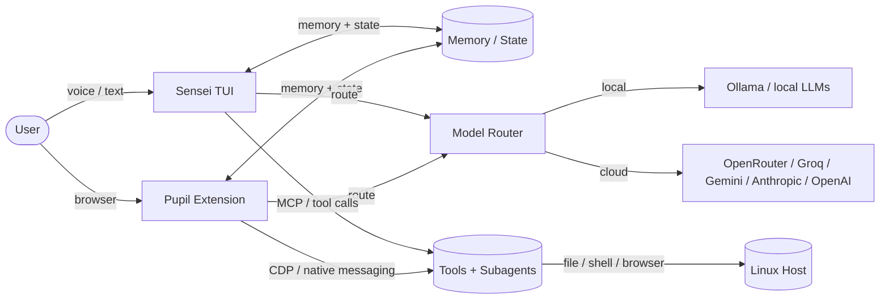

# Master AI CLI

> A local-first AI agent runtime with multi-provider routing, MCP tooling, browser automation, voice/vision, subagents, and a safety layer — running on your own hardware with your own API keys.

[](https://python.org)
[](LICENSE)
[](tests/)
[]()

**Two surfaces, one brain:**

- **Sensei** — the terminal/TUI agent. Reads, writes, runs commands, manages memory, delegates to subagents.
- **Pupil** — the browser extension. Same brain, same memory, visual side panel for web work.

The runtime routes between local models (Ollama) and cloud providers (OpenRouter, Groq, Gemini, Anthropic, OpenAI) based on task need, cost, and availability. It is designed to work offline by default and escalate to cloud only when necessary.

---

## What It Is

Master AI CLI is a **local-first agent runtime** built from scratch in Python. It implements the core pieces of a modern AI agent — loop, tool dispatch, model routing, memory, safety gating, browser integration, voice I/O, and headless delegation — without depending on a single vendor's cloud service.

Use it as:

- A daily terminal/TUI coding assistant
- A headless executor for other agents and CI pipelines
- A browser-aware agent via the Chrome extension
- A voice-controlled local AI on Linux desktops

---

## Capabilities

| Capability | What it does |
|---|---|
| **Multi-provider routing** | Auto-selects local Ollama or cloud providers by task, speed, and cost. Falls back across tiers. |
| **MCP integration** | Talks to external tools through the Model Context Protocol, not ad-hoc API glue. |
| **Browser automation** | Chrome extension with content scripts, CDP wiring, form filling, file uploads, screenshot parsing. |
| **Memory system** | Persistent cross-session memory for projects, preferences, and user context. |
| **Subagent system** | Spawns specialized workers: code review, file discovery, test execution, context inspection, spend tracking. |
| **Safety layer** | Approval queue for destructive actions, irreversible-action heuristics, privacy-cloud guard, permission modes. |
| **Voice I/O** | TTS server and STT server for talking to and hearing back from the agent. |
| **Vision** | Image understanding via LLaVA and image generation through the image engine. |
| **Skill runtime** | State-machine execution so agents can learn and run reusable skills. |
| **Multi-user profiles** | Up to 4 users per machine with isolated memory and config. |
| **Systemd services** | TTS, UI, prewarm, deep-clean timers — runs as first-class system services. |
| **Headless / delegation mode** | Non-interactive task execution with bounded tool turns and JSON output. |
| **Self-diagnostics** | Scans hardware and reports what models can run locally. |

---

## Architecture



**Core modules:**

| File | Lines | Responsibility |
|---|---|---|
| `master_ai.py` | ~14K | Core agent loop: `handle → process_reply → dispatch` |
| `sensei_tui.py` | ~1.1K | Terminal UI |
| `stt_server.py` | ~4.1K | Speech-to-text server |
| `sensei_reasoning_loop.py` | ~465 | Browser-turn reasoning |
| `skill_runtime.py` | ~476 | Skill state machine |
| `approval_queue.py` | ~403 | Safety: destructive-action approval |
| `hooks.py` | ~428 | Pre/post file-operation guards |
| `capabilities.py` | ~227 | Hardware capability detection |
| `observability.py` | ~214 | Monitoring and audit logging |
| `loop_fsm.py` | ~260 | Server-authoritative loop termination |
| `router.py` | ~111 | Model selection (local vs cloud) |
| `subagent_registry.py` | ~149 | Subagent registration and dispatch |
| `tts_server.py` | ~84 | Text-to-speech server |

**Browser extension:** `sensei_extension/` — content scripts, service worker, side panel, native messaging host.

**Subagents:** `subagents/` — code review, context inspector, file finder, test runner, spend reporter, workflow describer, directive simulator.

**Systemd services:** `systemd/` — TTS, UI, prewarm, deep-clean timer.

---

## By the Numbers

| Metric | Count |
|---|---|
| Python lines | ~43,000 |
| Shell lines | ~10,000 |
| JavaScript lines | ~7,900 |
| HTML lines | ~2,200 |
| Test files | 57 |
| Total files | 236 |

---

## Quick Start

```bash
# 1. Clone
git clone https://github.com/ebey317/master-ai-cli
cd master-ai-cli

# 2. Install (copies to ~/scripts/, sets up systemd, prompts for Ollama/models)
bash install.sh

# 3. Add API keys (Groq and OpenRouter have free tiers)
bash setup_keys.sh
bash setup_keys.sh --check   # validate keys against live APIs

# 4. Run
master-ai

# Or launch the TUI directly
sensei
```

For headless / CI / delegation:

```bash
master-ai --task "Review src/auth.py for security issues" --headless
master-ai --task-file /tmp/task.md --headless --max-turns 5
master-ai --task "Summarize the README" --headless --json
```

---

## Safety and Threat Model

Master AI is designed to operate directly on the user's machine, so safety is part of the architecture, not an afterthought.

| Concern | Mitigation |
|---|---|
| Destructive shell commands | Approval queue + irreversible-action heuristics |
| Secret exfiltration | Privacy-cloud guard; sensitive paths are gated or denied by default |
| Runaway loops | Server-authoritative loop termination FSM |
| Unauthorized file edits | Pre/post hooks with path fencing and denylist |
| Untrusted model output | Typed action dispatch with schema validation; failed parses are blocked and logged |
| Multi-user isolation | Per-user memory and config partitions |

The runtime defaults to **ask-before-execute** for anything that can delete, modify system state, or spend money. Permission modes (`default`, `acceptEdits`, `plan`, `auto`, `bypassPermissions`) let the operator choose their risk level.

---

## How I Explain the Architecture — The Nightclub

I had to understand this in my own words before I could build it. Here's the mental model:

> It's a nightclub.
>
> **Linux** is the building. He owns the place. His rules, his club.
>
> **Master AI** is the superintendent. Employee on Linux's payroll. Runs the building, hires the staff, manages operations.
>
> **MCP** is the promoter. The DJ speaks one language, the building speaks another. Without the promoter, the DJ can't talk to the staff. The promoter walks the room, knows everybody, translates intent into instructions.
>
> **The AI** is the DJ. Works the booth, picks the vibe, speaks his own language — but can't reach the floor alone. The promoter relays every instruction.
>
> **The tools** are the staff. Bouncers, bartenders, runners. They do the jobs the promoter relays from the DJ.
>
> **You** are the operator walking in. Not staff. The one who wanted the party.

Once you know who Linux is, what the superintendent does, why the promoter is the whole reason any of this works, and which staff do which jobs — you're not at the public party anymore. You're inside.

---

## Origin Story

- **April 2026** — Made a GitHub account. Empty profile.
- **May 13, 2026** — Built the first version of Master AI. Copy-pasting from terminals and chat boxes. No framework, no template.
- **May 19, 2026** — Published CLAF (Closed-Loop Agent Framework) as the public router layer.
- **June 2026** — Added browser automation, subagents, systemd services, 57 test files.
- **Present** — Running on Hermes Agent. The promoter still works. The nightclub is open.

I'm a self-taught developer. HVAC installer by day, building AI systems by night. I started with Anthropic's paid Claude, and it was good — but I couldn't afford it. So I found open models, found free API providers, and built an agent system that runs on my machine, uses my keys, follows my rules, and works whether I'm online or not.

---

## API / Service Interfaces

| Interface | Entrypoint | Purpose |
|---|---|---|
| CLI / TUI | `master-ai`, `sensei` | Interactive agent session |
| Headless | `master-ai --task ... --headless` | CI, automation, delegation from other agents |
| TTS server | `tts_server.py` | Text-to-speech output |
| STT server | `stt_server.py` | Speech-to-text input |
| Vision | LLaVA / image engine | Image understanding and generation |
| Browser extension | `sensei_extension/` | Visual surface via Chrome side panel |
| MCP | Model Context Protocol | Universal tool interoperability |

---

## Configuration

- `setup_keys.sh` — interactive API-key setup (stored in `~/.master_ai_keys`, mode `0600`)
- `install.sh` — system install, systemd services, Ollama/model prompts
- `pyproject.toml` — Python package configuration

---

## Contributing

1. Fork the repository
2. Create a feature branch: `git checkout -b feature/your-feature-name`
3. Make changes
4. Run the test suite: `pytest`
5. Run linters: `ruff check .` and `black --check .`
6. Run shellcheck: `shellcheck *.sh`
7. Commit and push
8. Open a pull request

### Code style

- PEP 8 with 88-character line length (Black)
- `ruff` for linting
- Unit tests for new functionality
- Docstrings for public APIs
- Never commit API keys or secrets

---

## License

MIT — see [LICENSE](LICENSE).

---

## Author

**Elijah Wilkins** — AI systems builder, HVAC engineer, creator of Master AI.

- GitHub: [@ebey317](https://github.com/ebey317)
- Repository: [ebey317/master-ai-cli](https://github.com/ebey317/master-ai-cli)

> *Working in the gray. Turning words into manifestation.*
